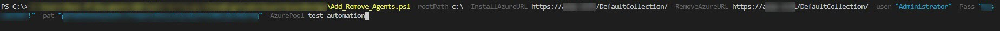
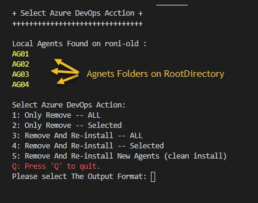
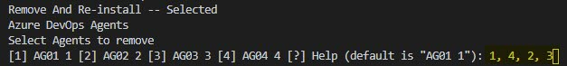
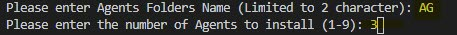

# Azure DevOps Agents Managment
this script is ment to help you find old Azure DevOps/TFS Agent instlletion on windows and configure them or remove them

## How-to Run the Script
1. run the script *As an administrator* with all needed CLI paramters:
```Add_Remove_Agents.ps1 -rootPath c:\ -InstallAzureURL https://<URL>/DefaultCollection/ -RemoveAzureURL https://<URL>/DefaultCollection/ -user "<User>" -Pass "<Password>" -pat "<TOKEN>" -AzurePool <AgentsPool>```

    * here are the Paramters you need to assainge as Command-Line input: <br/>
        - [ ] $rootPath (Default ="c:\" )
        - [ ] $RemoveAzureURL
        - [ ] $InstallAzureURL
        - [ ] $Pass
        - [ ] $user
        - [ ] $AzurePool
        - [ ] $pat
    * the script will search for Agents Folders in the pre-set `$RootDirectory` and give you and out put in the CLI menu.

* Select desired Option.
    * if you selcted `Selected` Agents install or removal you will be redirected to a multi-option menual to select the agent you wish to remove/install.
    * to select more then 1 Agent to remove or install use comma and space between each number (example: 1, 2, 4, 6)

* if selecte *Clean Install* all found Agents will be Auto-removed, including folders and you will be prompted to select a *New Directory Name* for the agents, as well as the Desired number of agents.


